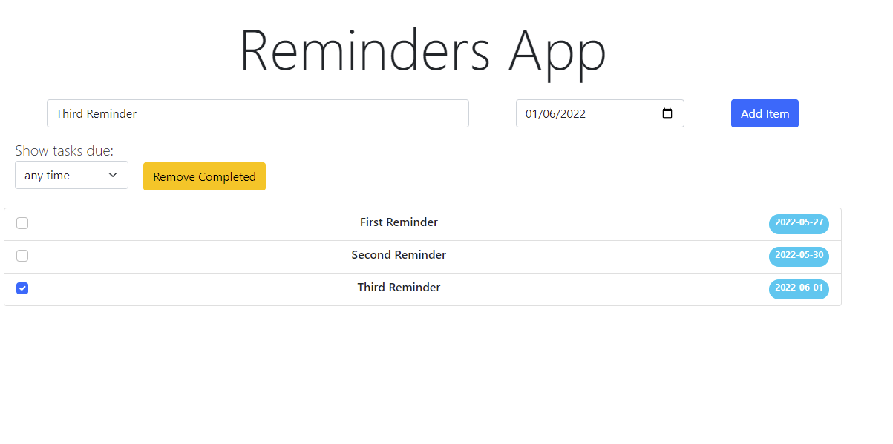

# Reminders App - React App

This project is an implemention of a reminders app using the ReactJS Library.

## Table of contents

- [Overview](#overview)
  - [Functionality](#functionality)
  - [Screenshot](#screenshot)
  - [Links](#links)
- [Process](#process)
  - [Built with](#built-with)
  - [Data Flow](#data-flow)
- [Author](#author)

## Overview

### Functionality

Users should be able to:

- Create, Read new reminders using the input form.
- Create reminders using a due date of choice.
- Individually mark completed reminders.
- Delete completed reminders using Remove Completed button.
- Filter reminders based on timeframe
  - within 2 days
  - within 1 week
  - withing 30 days
  - any time (default)

### Screenshot

### Links

- Solution URL: [Add solution URL here](https://github.com/Rravg/reminders-app)
- Live Site URL: [Add live site URL here](https://rravg.github.io/reminders-app/)

## Process

### Built with

- [React](https://reactjs.org/) - JS library
- [Bootstrap](https://getbootstrap.com) - CSS Library

### Data Flow

Components

- App
  - InputForm
  - FilterSelect
  - Remove
  - RemindersList
    - Reminder

All the state variables are held by the App component, since this is the common component that uses all the state variables and is at the top the tree (all the state variables were lifted up).

## Author

- Github - [Rodrigo Alexander Villalobos](https://github.com/Rravg)